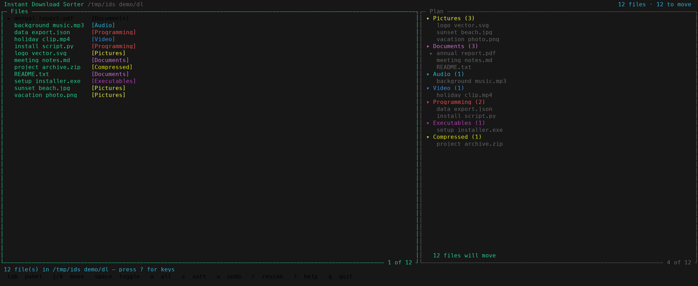
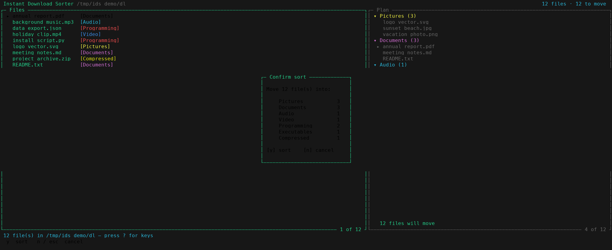
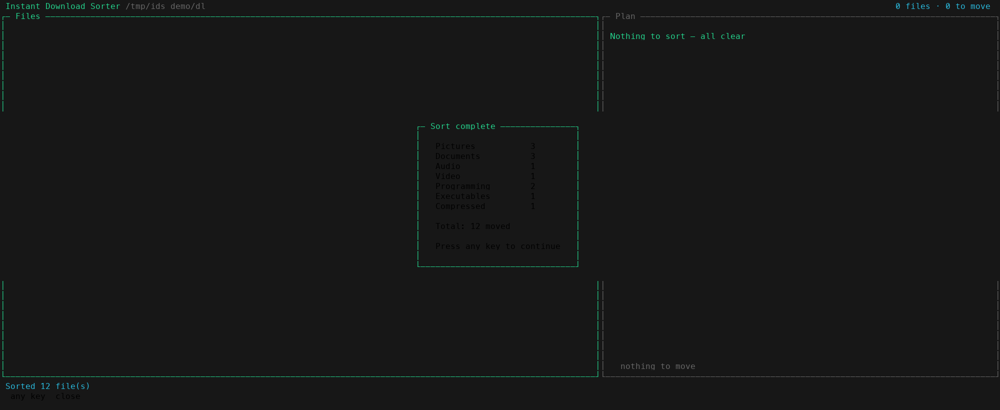

# How to run

## Screenshots



The main screen: the **Files** panel (left) lists everything in your folder with
its detected target folder, and the **Plan** panel (right) groups the files by
where they'll be sorted to.



Pressing `s` first shows a confirmation of the moves — nothing is overwritten
and nothing moves until you confirm.



After you confirm, a summary reports how many files went into each folder.

Have Python 3 installed and available in PATH as either `py` or `python`.  
go inside CMD at `/src` and:  
- run `InstantSorter.py` with python.

## Make / Shell

install make with Choco on windows (requires privileges):
`choco install make`

then run

`make run` in 'InstantDownloadSorter'-folder.
See the [Makefile](Makefile) file

`settings.json` should have a valid configuration.

You can also run `run.sh`.
See the [run.sh](run.sh) file

This is the default for windows:

```json
{"FolderLocation": "C:\\Users\\<Username>\\Downloads\\",
"Folders":  [
  {"Pictures": [".jpg", ".JPG", ".jpeg", ".png", ".gif"]},
  {"Documents":  [".md",".pdf",".txt",".docx", ".xlsx", ".pptx"]},
  {"Audio":  [".mid",".wav",".mp3", ".ogg"]},
  {"Programming":  [".html", ".css", ".js", ".cs", ".java", ".py"]},
  {"Executables": [".exe",".msi",".apk",".iso"]},
  {"Compressed": [".zip",".gz",".7z",".rar"]},
  {"Gaming":  [".sqf",".sqm",".ext", ".savegame"]}
]}
```

FolderLocation should be the path to the folder you want to sort.  
Folders is an array of objects with one key-value pair, where the key is a Foldername and the value a list of extensions  
that should be put inside the belonging Folder(name).  
Beware that double extensions will be sorted to their first occurrence.
